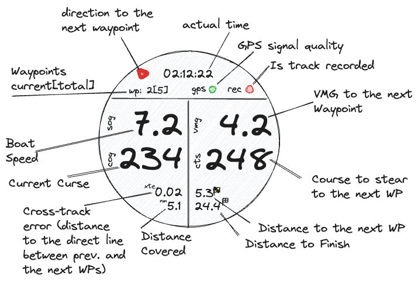

# Yet-Another-Sailing-App

### install

https://apps.garmin.com/en-US/apps/159028ac-590b-4836-a1e2-474d248469c5

### feedback 

https://github.com/Laverlin/Yet-Another-Sailing-App/issues

### description

There are a few nice sailing apps already, but this is yet another one... =)   

This app has 
- Race Timer with ISAF starting sequence support 
- Cruise view with speed, bearing and other valuable data
- Route View, advanced Waypoint mode to track your way along specified route 
- Laps view 

In **Route** mode you may track you way along specified route. There will be displayed SOG, COG, VMG, Course to closest waypoint, amount of way points along the route (and the current WP), distance to WP, distance to finish, distance covered and Cross-track error.
The Navionics (navionics.com) is used to setup the route.
**Note** This mode is not available on D2/Bravo/Titanium and Fx3/HR watches due to low available memory on these devices.       

In **Cruise** mode you may see at one glance, actual speed, bearing, max speed and avg speed for last 10 seconds. Also, there are set of helpful indicators, like GPS status, recording status and actual speed vs avg speed, which is very useful for sail trimming.
Moving average of bearing for last 10 sec. could be helpful in long-distance cruise.   

In **Race Timer** mode you may see remaining seconds till start, actual time and speed. You can also adjust countdown timer by one sec up and down, and down to next minute.

In **Laps view** you may see data - max speed, average speed, distance and time for last 20 laps  

### usage

- In any view press and hold UP (over 2 sec.) to get access to main menu.    
	In main menu you may choose   
   -- switch to *Race Timer* mode  
   -- switch to *Cruise* mode   
   -- switch to *Route* mode
   -- switch to *Laps view*  
   -- change settings: initialize Race Timer, change Background Color and enable/disable Auto recording  

**Route** mode:
This is a bit tricky and here is a short description why is that. Watches has a limited UX ability and setting a waypoint[s] is not a very convenient. A little more handy using phone for this, but still typing a GPS coordinates is not how you'd like to spend your time... On the other hands, there is a lot of nice services and applications, which allows you to plan a route, so why is not use one of them?
After some considerations I chose the "Navionics" (navionics.com) for that purpose. So, the basic idea is to plan your route in Navionics and export it to the Yet-Another-Sailing-App, to track this Route during the cruise, on a watch, leaving the phone on the pocket.
Sounds good, but unfortunately Navionics does not have an API to import routes... Fortunately, Navionics mobile app has an option to export saved Route in a well known format. Unfortunately, there is no option to export it directly to the Watch Application, so we need some intermediate service which should be able to accept Routes from Navionics mobile App and has an API for import Routes to the watch application. It turns out for such kind of scenarios chat bots, like Telegram bots, work surprisingly good.
So, in general it works like this:
- plan your route in Navionics mobile app or web-site.
- open Navionics mobile app and export your route to Telegram bot, named "YA-SailingBot" (you have to install telegram messenger on your iPhone or Android and type @YA-SailngBot in search to enable the bot)
- in response *YA-SailingBot* will send back your user id
- you have to put this ID in settings of Yet-Another-Sailing App, using Garmin Connect mobile application. (open Garmin Connect mobile app, then tap device icon on the top row -> Activities, Apps & More -> Activities & Applications, choose Yet Another Sailing App and tap Settings). You need to do this just once, any uploaded route will have the same user id, unless you change your Telegram account.
- now open YAS app on your watch and choose Route -> Load Routes.
- choose route and you ready to go!
UP and DOWN buttons on your watch will change current waypoint.
START/STOP button will start/stop track recording, just like in *Cruise* mode

Couple notes about YA-SailingBot telegram bot:
- Navionics allow to change route name but for some reason does not export it. But you can change Route name using /rename command
- Use /list command to get list of available routes and /delete:<id> command to delete route by id      
- /myid command will send you string with your id 
  
In **Cruise** mode     
- press start/stop button to start/stop recording. This option available only if GPS signal strong enough (gps indicator yellow or green)
- press back button to add new lap. Laps statistic available in *Laps View*.  
 
In **Race Timer** mode   
- UP add one second to countdown timer
- DOWN subtract one second from countdown timer
- BACK round timer to nearest minute down 
- START start/stop countdown
After countdown ends, app will automatically add one lap (if activity is recording) and switch to *Cruise* mode.

In **Laps View** you can see data from last 20 laps. This data stores permanently, even if you close the app and start it again, laps data will be on place  
- UP shows previous lap
- DOWN scroll to next lap
- BACK offer you to clear all laps from permanent storage and drop lap counter to zero.  

